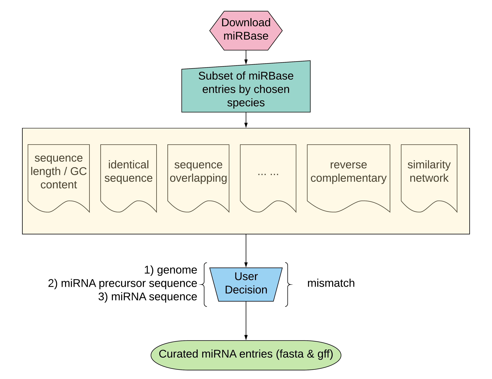

# miRBaseMiner
Version: 0.2
python version: 2.7

####  Any feedback and contributions are appreciated. 

## The workflow of miRBaseMiner

## Usage
## Install
Users can install miRBaseMiner by `pip install miRBaseMiner`.
Currently, miRBaseMiner is programmed in python 2.7

### miRBaseMinerInterface.py is a user interface to run miRBaseMiner
Users can set up parameters in the "SET UP" section of miRBaseMinerInterface.py
After set up, user can run miRBaseMiner via `python  /YOUR_PATH_TO_SCRIPT/miRBaseMinerInterface.py`.

Users can also have a demo run by 

    import miRBaseMiner as miner
    miner.DMOminning()
in command line or python script. This demo run will download three versions of miRBase (v20, v21, v22), and investigate annotation from _Homo sapiens_.

## Results
In user specified result folder (by default, the result folder will be in the current work directory), there will be two sub folders: (1) `resultsTables` and (2) `miRBase`. `miRBase` contains all available data within each version of miRBase under respectively folder named with version number. `resultsTables` contaains all output files and generated figures from each selected analysis sections. In addition, two folders will be generated in `resultsTables` : (1) `curatedSet`: curated set of annotation based on original miRBase entries; (2) `Rscripts`: R scripts that generated and used for data visulization.

All result files are systemically named, joined "miRBase", version information, species information and key word indicating file content with underline.

## Dependency
Before run miRBaseMiner, make sure that you have all required python libraries and R packages.

    python: (1)SeqIO and Seq from biopython; (2) editdistance; (3) ftplib.

    R: (1) ggplot2; (2) tm; (3) wordcloud; (4) scales; (5) ggseqlogo; (6) igraph. 

